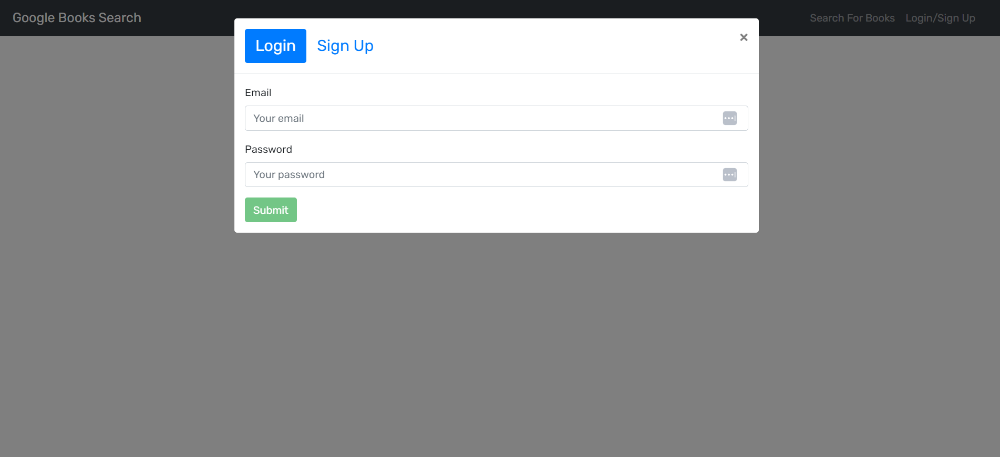

# Book-Search

## Description

This application is a book search engine. The app uses GraphQL and React to incorporate a database that the user can access and manipulate to store favorites and search specific books.

## Usage

To run the Application on your local server, the user must first open a terminal and enter "npm install". Once that is complete the user can then enter "npm run develop". This will generate a GraphQL server and also a local host to see the website in action. 

The application is a search engine that a user can log in to. There is a "login" button on the top right where the user can create or sign in to their account. There is also a "Search For Books" button where the user can go to look up books of their interest in the search bar. When a user is logged in to the application, they will have the ability to save books to their favorites which they can view on their profile. 

 

 [Github Test URL](https://booksgalore-6552f1b04034.herokuapp.com/)